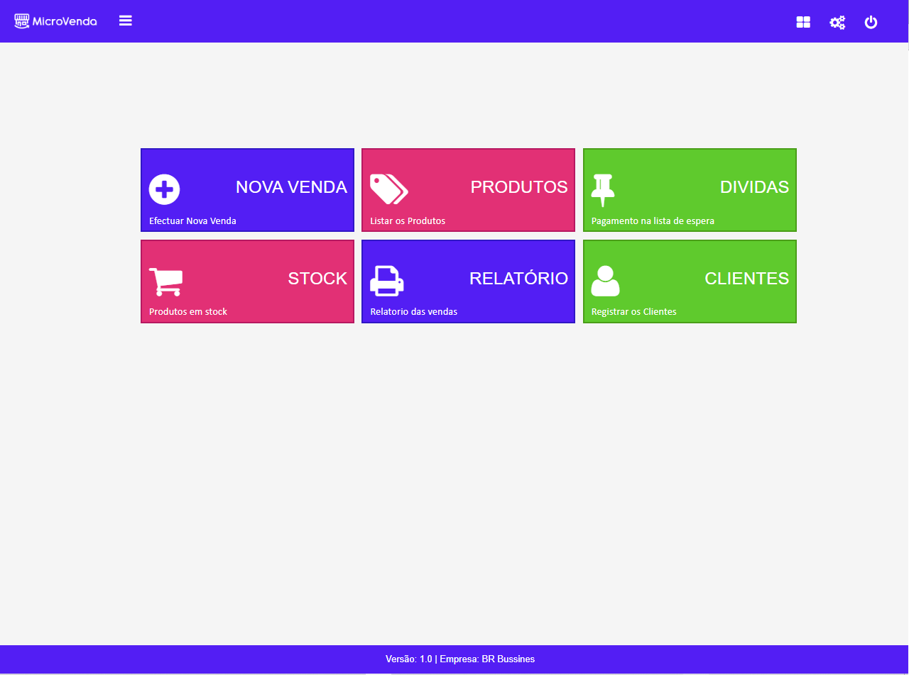
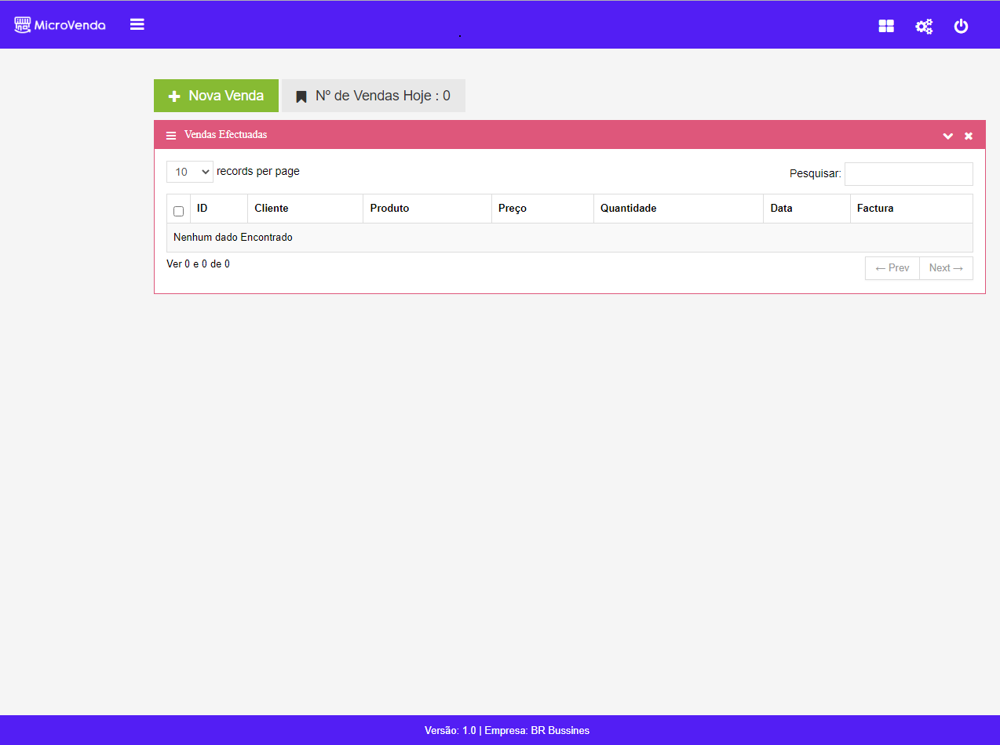
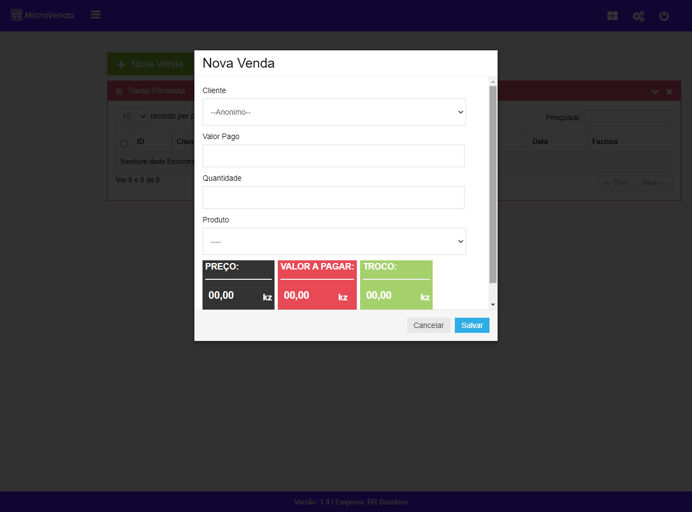

# Sistema de Vendas com PHP e jQuery

O **Microvendas** é um sistema de vendas projetado para simplificar a gestão de vendas em pequenas lojas.

## Tecnologias Utilizadas

Este sistema foi desenvolvido com as seguintes tecnologias:

- **PHP**: Utilizamos a linguagem PHP no back-end, seguindo o padrão MVC (Model-View-Controller) para uma estrutura organizada e eficiente.

- **jQuery**: Para aprimorar a experiência do usuário, incorporamos a biblioteca jQuery no front-end, proporcionando interatividade e dinamismo à interface.

## Capturas de Tela do Projeto

A seguir, apresentamos algumas capturas de tela do Microvendas:

### Tela de Login

### Menu Inicial

### Realizar Vendas

Explore todas as funcionalidades do Microvendas para facilitar a gestão das vendas da sua pequena loja. Este sistema foi projetado para proporcionar uma experiência eficiente e intuitiva para os usuários.

Sinta-se à vontade para contribuir, fazer sugestões ou relatar problemas. Estamos em constante aprimoramento do Microvendas para atender melhor às suas necessidades.
